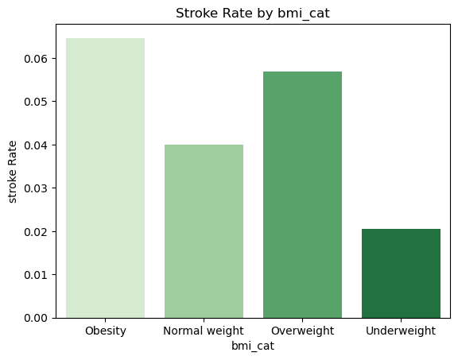
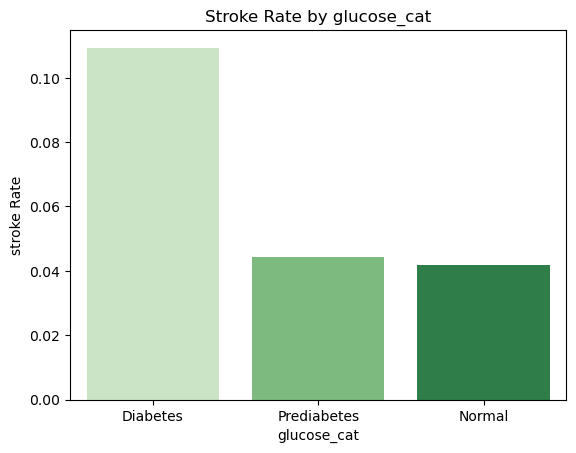

# Stroke-prediction

## overview
This notebook explores a dataset related to stroke occurrences to understand and predict the risk factors associated with stroke. The analysis includes data preprocessing, exploratory data analysis (EDA), feature engineering, and model evaluation. The ultimate goal is to identify significant factors contributing to stroke risk and to develop a model that can predict high-risk individuals
## business understanding
### Problem Statement
Stroke is a critical medical condition with significant health implications. Understanding the factors that contribute to stroke risk is essential for early intervention and prevention. This analysis aims to:

Identify Factors: Determine which factors most significantly contribute to stroke risk.
Risk Identification: Develop methods to identify high-risk individuals using the available data.
Preventive Measures: Suggest preventive measures tailored to different risk profiles based on the findings.
## Data understanding and analysis
### Key Findings
  #### 1.Significant Factors:

Features such as hypertension, heart_disease, bmi_cat, and glucose_cat were found to significantly influence stroke risk.
The presence of hypertension and heart disease showed a strong correlation with higher stroke risk.
Graph:

Correlation Heatmap - Shows the correlation between numerical features and stroke.
Mutual Information Scores - Illustrates the relevance of categorical features with respect to stroke risk.
   #### 2.High-Risk Identification:

The analysis revealed that individuals with high BMI or high glucose levels are at increased risk of stroke.
Categorical features like smoking status and work type also provided insights into stroke risk distribution.
Graphs:

BMI Category vs. Stroke Rate - Displays stroke rates across different BMI categories.

Glucose Category vs. Stroke Rate - Shows stroke rates for various glucose levels.

Count Plots of Categorical Features - Visualizes the distribution of stroke risk across different categories.
#### 3.Preventive Measures:

Based on the findings, preventive measures can include lifestyle modifications for individuals with high BMI or glucose levels.
Tailored health screenings and interventions are recommended for individuals with hypertension or heart disease.
Graphs:

Preventive Measures Impact - A hypothetical visualization of the impact of various preventive measures based on the findings.
## Results

## Conclusion 
The analysis successfully identified key factors contributing to stroke risk and demonstrated the utility of various features in predicting stroke occurrences. The data-driven insights offer a foundation for targeting high-risk individuals and implementing effective preventive measures.
## Recommendations
1.Health Monitoring: Regular monitoring and intervention for individuals with high BMI and glucose levels.
2.Personalized Prevention: Develop personalized prevention plans for individuals with hypertension or heart disease.
3.Public Health Initiatives: Implement public health initiatives to raise awareness about stroke risk factors, particularly targeting high-risk populations.
4.Model Development: Further refine predictive models using additional features and advanced techniques for more accurate stroke risk predictions.